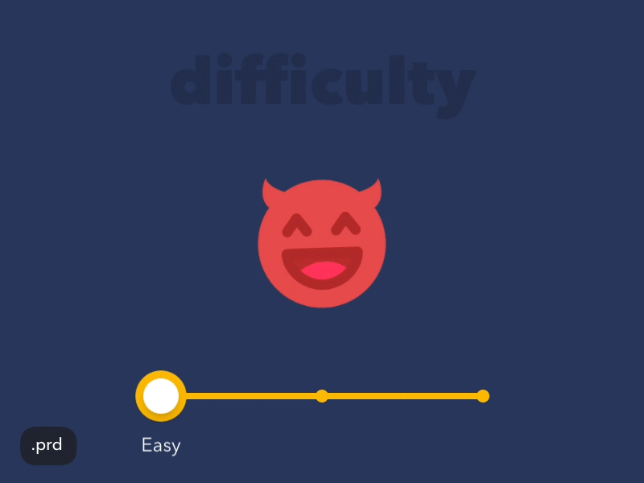

# **Minicurso Javascript**

Minicurso de Javascript apresentado pelo [@marcobrunodev](https://www.twitch.tv/marcobrunodev) na twitch.

O curso consiste em 4 aulas de introdução ao Javascript e uma leve teoria de React

Objetivo é gerar algo como o exemplo abaixo:

___
# Aulas:

## Aula 1 (commit = b528309d8ec5e88bb51a88d92d68e5b520ef7d70)
 - Iniciação do arquivo .html e .js 
 - Criação de uma função para inserção de elementos html

## Aula 2 (commit = f264e26f1d69518c6c9c9ac596def6640d9acde7)
 - Apresentada o template de Tagged Template String
 - Components(Necessário instalar o styled.components no npm)

## Aula 3 (commit = caca935b7b5ec3e5bfc5767522c93d953a8cfb9b)
 - Adicionado personagem Bulbasaur
 - Tecnica de Wrapper
 - Alteracao das cores basicas para combinar com personagem.